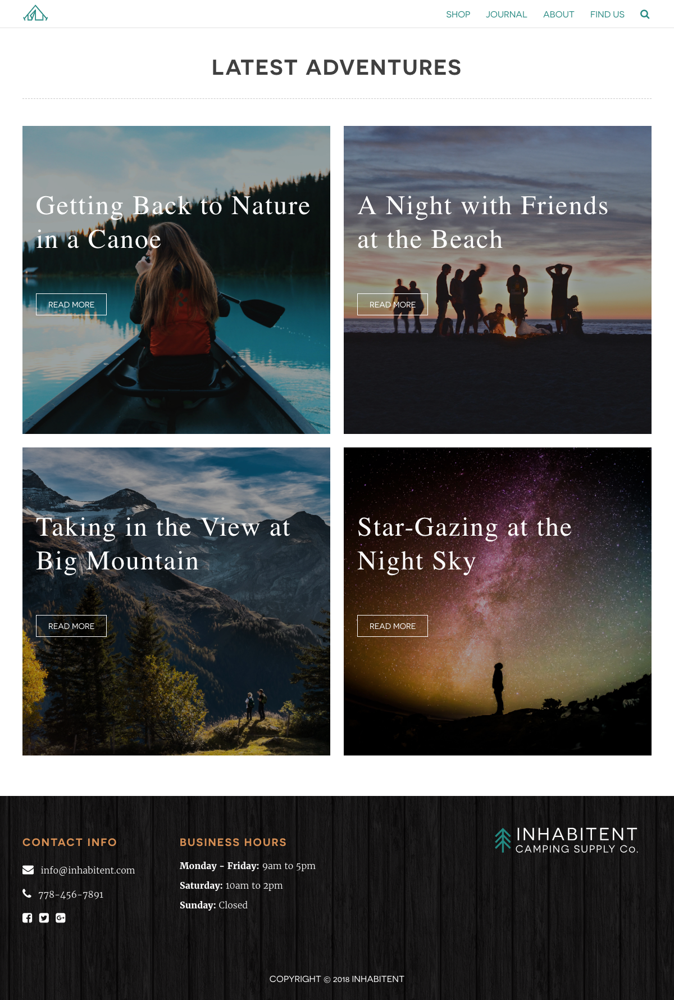

# Project: Inhabitent Wordpress Site.
## About this project
You can see this project on-line, going to [Inhabitent Wordpress Site](http://margaomar.com/Inhabitent/index.html)

----
## Goals of the site
This site has been created to learn how to create a customized wordpress theme, building custom plugings to be able to add custom fields to the products in the store, and creating custom widgets which the client will be able to change the opening hours, contact details or social links. 

Wordpress Technology, PHP, JQUERY, HTML5 and CSS3. 

> Hand-Crafter Styles
Inhabitent Wordpress Site has five different sections: home, shop, blob, adventures, about and contact. Each of them have a different style and archive files. Inhabitent is proud to offer their visitor a different experience on each page of his site.

----
## Technology used
Wordpress | PHP | WP Plugings | JQuery | HTML5 | CSS3 | Gulp | Sass (CSS Preprocessors) | Git | Github | FontFace | 

----
## Personal Learnings

1. PHP
2. Wordpress technology: 
3. Functions, Hooks, Debugging, Post Types, Taxonomies and Fields
4. WP Custom Widgets 
5. WP Custom Plugings
6. JQuery

----
## Link to the files on Github
* **[Inhabitent Wordpress Site on Github](https://github.com/margaomar/Inhabitent)**

----
## Media Query Break Point (only desktop view for this project)

* 1200px

----
## Device Screenshots
----

----
----

>Home page
----

----
>Shop page
----

----
>Single product page
----

----
>Blog page

----
>Single post page
----

----
>About page
----

----
>Find us page
----

----
>Adventures page
----

----
>Single adventures page
----

----

----
## Dead Line for the project
* 22-Nov-2018

----
## Project developed by 
 **[Marga Omar](https://margaomar.com)**